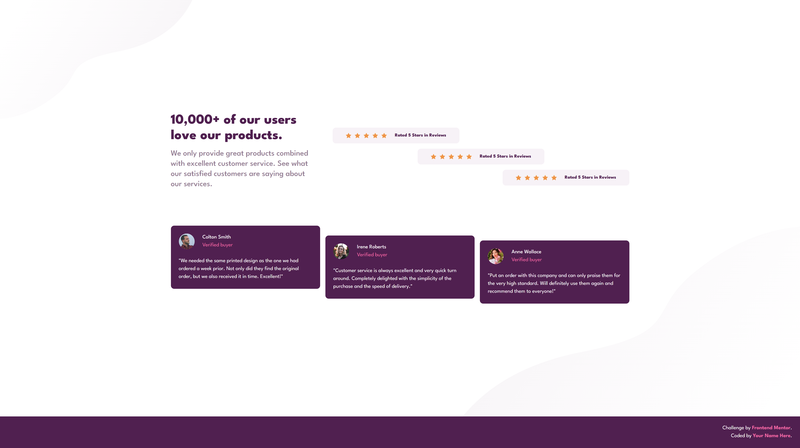

# Frontend Mentor - Social proof section solution

This is a solution to the [Social proof section challenge on Frontend Mentor](https://www.frontendmentor.io/challenges/social-proof-section-6e0qTv_bA). Frontend Mentor challenges help you improve your coding skills by building realistic projects. 

## Table of contents

- [Overview](#overview)
  - [The challenge](#the-challenge)
  - [Screenshot](#screenshot)
  - [Links](#links)
- [My process](#my-process)
  - [Built with](#built-with)
  - [What I learned](#what-i-learned)
  - [Continued development](#continued-development)
  - [Useful resources](#useful-resources)
  - [AI Collaboration](#ai-collaboration)
- [Author](#author)
- [Acknowledgments](#acknowledgments)

**Note: Delete this note and update the table of contents based on what sections you keep.**

## Overview

### The challenge

Users should be able to:

- View the optimal layout for the section depending on their device's screen size

### Screenshot



### Links

- Solution URL: [Add solution URL here](https://peterp205.github.io/Social-proof-section-Frontend-Mentor-/)

## My process

### Built with

- Semantic HTML5 markup
- CSS custom properties
- Flexbox


### What I learned

I took this project on to really explore a little about how to offset the sections within a flexbox. I used a mixture of margin-top and align-self to acomplish this on the desktop view. At first I tried to use position relative with a left position or top however Gemini helped to explain the potentially long term negative effects to this so adapted to a more accessible solution. Below is some of the CSS which helped me acomplish this. I also hadn't applied multiple images into the background, this was the first time doing this which was surprisingly easy. I would like to know more however about how they overlap and work I should do further experimentation with this as I have seen it used on a lot of websites to good effect.

```css
 /* Card 1: Snaps to the left edge */
  .review-card:first-of-type {
    align-self: flex-start;
  }

  /* Card 2: Snaps to the dead center */
  .review-card:nth-of-type(2) {
    align-self: center;
  }

  /* Card 3: Snaps to the right edge */
  .review-card:last-of-type {
    align-self: flex-end;
  }

    /* Card 1: sits normally */
  .buyer-review-card:first-of-type {
    margin-top: 0;
  }
  /* Card 2: Pushed over a bit */
  .buyer-review-card:nth-of-type(2) {
    margin-top: 6rem;
  }
  /* Card 3: Pushed over the most */
  .buyer-review-card:last-of-type {
    margin-top: 9rem;
  }

```

### Continued development

I think for the next project I really need to apply grid. Currently I always rely on flexbox as I have more understanding of this tool. I know Grid would be good at other times however but get nervous due to lack of knowledge. I will aim to use that in my next project.

### Useful resources

- [Example resource 1](https://www.example.com) - This helped me for XYZ reason. I really liked this pattern and will use it going forward.
- [Example resource 2](https://www.example.com) - This is an amazing article which helped me finally understand XYZ. I'd recommend it to anyone still learning this concept.

**Note: Delete this note and replace the list above with resources that helped you during the challenge. These could come in handy for anyone viewing your solution or for yourself when you look back on this project in the future.**

### AI Collaboration

Throughout this project I used Gemini to act as guidance on unsure areas. I also have installed windsurf for line completion within VSCode Studio. I try not to use the auto completion much a the moment however as I feel that the manual writing helps to further understanding and writing knowledge. Also it includes too much code that's not really needed. I use Gemini in the following ways:

- Code reviews at the end of the project
- To check if the solution I have just created works effectively or may run into bad practices such as the using of `position: relative` and `top:0;` which was my first attempt at offsetting some of the sections.
- The use of the frontend mentor file for AI really helped to stop  Gemini just giving me all the answers.
- The use of screenshots along with file upload helps to ensure Gemini understands what I mean
- AI still provided solutions which may be out of date e.g. using `margin: 0;` instead of `align-self: start;`


## Author

- Website - [Cacti Web Design](https://www.cv.cactiwebdesign.com)
- Frontend Mentor - [@peterp205](https://www.frontendmentor.io/profile/peterp205)
- LinkedIn - [@PeterBrewster](https://www.linkedin.com/in/peter-brewster-9342792a5/)
